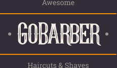

# GoBarber API

  

 

  
  
  

## ℹ️ Sobre

Este projeto consiste em uma API desenvolvida durante o [Bootcamp GoStack](https://pages.rocketseat.com.br/gostack) da Rocketseat com o objetivo de fornecer funcionalidades para o front-end [GoBarber Web](https://github.com/amandabezerra/gobarber-web) e mobile [GoBarber App](https://github.com/amandabezerra/gobarber-app).

## 💻 Tecnologias

+ [Typescript](https://www.typescriptlang.org/)
+ [Node.js](https://nodejs.org/)
+ [Express](https://expressjs.com/)
+ [TypeORM](https://typeorm.io/)
+ [PostgreSQL](https://www.postgresql.org/)
+ [JWT Token](https://jwt.io/)
+ [Multer](https://www.npmjs.com/package/multer)
+ [Jest](https://jestjs.io/)
